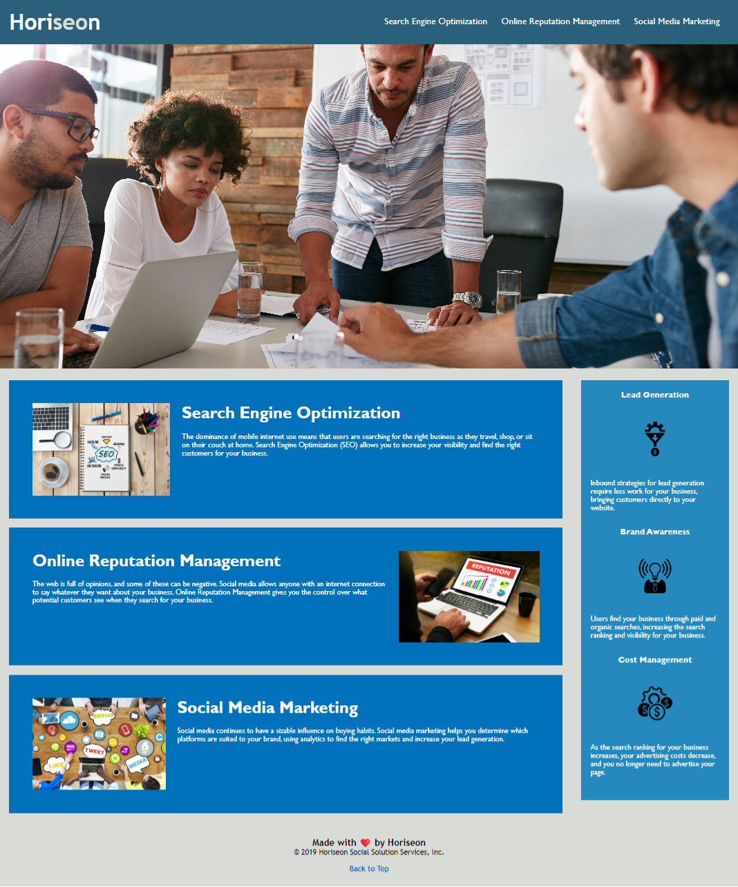

# Horiseon Search Engine Optimization

In this webpage we were asked to take an existing page and bring it to current standards.

### Webpage Link
https://arlindo2017.github.io/horiseon-search-engine-optimization/

### Webpage Picture

## Class Task

**Refactoring** existing code (improving it without changing what it does) to meet a certain set of standards or to implement a new technology is a common task for front-end and junior developers. For this particular Challenge, a marketing agency has hired you to refactor an existing site to make it more accessible. 

An increasingly important consideration for businesses, web **accessibility** ensures that people with disabilities can access a website using assistive technologies like video captions, screen readers, and braille keyboards. Accessibility is good for business&mdash;for one thing, accessible sites rank higher in search engines like Google. It also helps companies avoid litigation, which might arise if people with disabilities can't access a website.

Accessibility can include complex requirements, but your tech lead has given you a small list of specific criteria for this project. These criteria are documented in the Acceptance Criteria section.

## Note
This layout is designed for "desktop", so you may notice that some of the elements don't look like the Mock-Up when viewed at a resolution smaller than 768px. In future lessons, you will learn how to make elements "responsive" so that your web application is optimized for any screen size.

## Recommended future enhancements
- Page needs to be updated to support mobile devices.

## Learnings from this challenge
- Semantic HTML.
- Importance of making websites accessible for users with disabilities.
